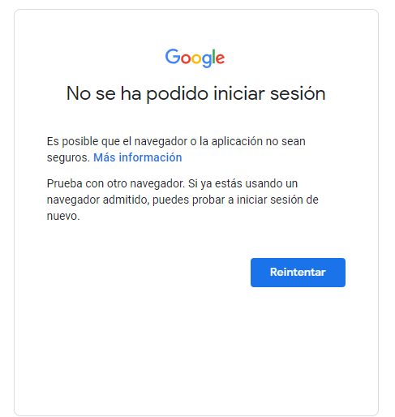

# Proyectos de Automatización QA - Login Gmail

### Ejecución de las Pruebas
Desde la raíz de proyecto por línea de comando ejecutar

gradlew clean test 

### Tecnologías Utilizadas
- Lenguaje de programación: Gherkin, Java
- Driver: Selenium
- Framework: Cucumber, Serenity, Selenium
- Patrón de diseño: Screenplay

### Reporte Serenity
target/site/serenity/index.html

### Consideraciones

El correo utilizado en las pruebas "testgmlq@gmail.com", se creo exclusivamente para la ejecución del proyecto de automatización, 
usar correos personales, puede generar errores en la ejecución, ya que Gmail reconoce el uso de un bot y bloquea el Login.

